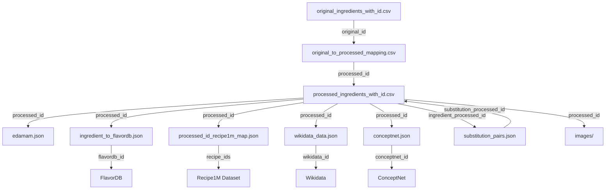
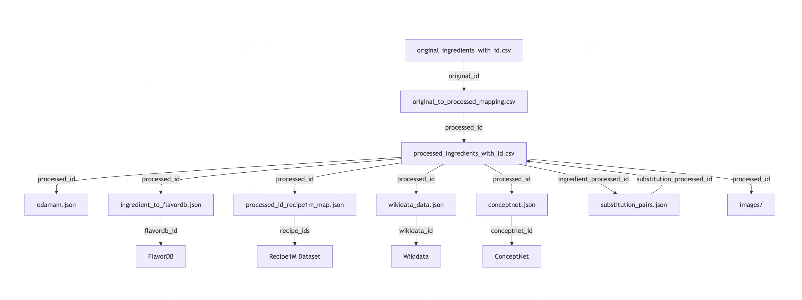

# Multimodal Ingredient Substitution Knowledge Graph for Personalized Dietary Recommendations (MISKG)

## Abstract

Ingredient substitution is essential in adapting recipes to meet individual dietary needs, preferences, and ingredient availability. We introduce a Multimodal Ingredient Substitution Knowledge Graph (MISKG) that captures a comprehensive and contextual understanding of 16,077 ingredients and 80,110 substitution pairs. The KG integrates semantic, nutritional, and flavor data, allowing both text and image-based querying for ingredient substitutions. Utilizing various sources such as ConceptNet, Wikidata, Edamam, and FlavorDB, this dataset supports personalized recipe adjustments based on dietary constraints, health labels, and sensory preferences. This work addresses gaps in existing datasets by including visual representations, nutrient information, contextual ingredient relationships, providing a valuable resource for culinary research and digital gastronomy.

## File Descriptions and Purposes

1. **competition/original_ingredients_with_id.csv**
   - Purpose: Provides a list of original, unprocessed ingredient names.
   - Columns: id (original_id), original
   - Example: 59e6c716,ababai

2. **competition/processed_ingredients_with_id.csv**
   - Purpose: Offers a cleaned, standardized list of ingredient names.
   - Columns: id (processed_id), processed
   - Example: d5a8268e,ababai

3. **competition/original_to_processed_mapping.csv**
   - Purpose: Maps original ingredients to their processed counterparts.
   - Columns: original_id, processed_id, original, processed
   - Example: 59e6c716,d5a8268e,ababai,ababai
   - Note: Some original ingredients may map to an empty string in processed form.

4. **competition/edamam.json**
   - Purpose: Provides nutritional information for ingredients.
   - Key: processed_id
   - Example fields: ingredient_name, food_id, category, nutrients, label, weight, uri
   - Example:

     ```json
     "b8b2e121": {
       "ingredient_name": "fish sauce",
       "food_id": "food_ahlu6u3ab8bu1wap7cbqua3s1quk",
       "category": "Generic foods",
       "nutrients": {
         "ENERC_KCAL": 35.0,
         "PROCNT": 5.06,
         "FAT": 0.01,
         "CHOCDF": 3.64,
         "FIBTG": 0.0
       },
       "label": "Serving",
       "weight": "5.0",
       "uri": "http://www.edamam.com/ontologies/edamam.owl#Measure_serving"
     }
     ```

5. **competition/ingredient_to_flavordb.json**
   - Purpose: Maps ingredients to flavor profiles from FlavorDB.
   - Key: processed_id
   - Example fields: ingredient, flavordb_id, flavordb, cosine_similarity
   - Example:

     ```json
     "a5bd8077": {
       "ingredient": "abalone",
       "flavordb_id": 38,
       "flavordb": "abalone",
       "cosine_similarity": 1.0
     }
     ```

6. **competition/processed_id_recipe1m_map.json**
   - Purpose: Links ingredients to recipes in the Recipe1M dataset.
   - Key: processed_id
   - Example fields: name, original_id, recipe_ids (list of recipe IDs using this ingredient)
   - Example:

     ```json
     "76b8b630": {
       "name": "penne",
       "original_id": "558b7f02",
       "recipe_ids": ["000018c8a5", "006a7c00c4", "00ab15a16a", ...]
     }
     ```

7. **competition/substitution_pairs.json**
   - Purpose: Defines substitution relationships between ingredients.
   - Fields: ingredient, substitution, ingredient_original_id, substitution_original_id, ingredient_processed_id, substitution_processed_id
   - Example:

     ```json
     {
       "ingredient": "arrowroot",
       "substitution": "flour",
       "ingredient_original_id": "7c369462",
       "substitution_original_id": "27450ef2",
       "ingredient_processed_id": "f41030c9",
       "substitution_processed_id": "4cf0bf0f"
     }
     ```

8. **competition/wikidata_data.json**
   - Purpose: Offers additional encyclopedic information about ingredients.
   - Key: processed_id
   - Example fields: type, id, labels, descriptions, claims
   - Example: (Abbreviated for brevity)

     ```json
     "d5a8268e": {
       "type": "item",
       "id": "Q31780235",
       "labels": {
         "en": {"language": "en", "value": "Abābāi"}
       },
       "descriptions": {
         "en": {"language": "en", "value": "mountain in Pakistan"}
       },
       "claims": { ... }
     }
     ```

9. **competition/conceptnet.json**
   - Purpose: Provides semantic relationships and common-sense knowledge about ingredients.
   - Key: processed_id
   - Example fields: @context, @id, edges (list of related concepts and relationships)
   - Example: (Abbreviated for brevity)

     ```json
     "a5bd8077": {
       "@context": ["http://api.conceptnet.io/ld/conceptnet5.7/context.ld.json"],
       "@id": "/c/en/abalone",
       "edges": [
         {
           "@id": "/a/[/r/Synonym/,/c/fr/haliotis/n/wn/animal/,/c/en/abalone/n/wn/animal/]",
           "rel": {"@id": "/r/Synonym", "label": "Synonym"},
           "start": {"@id": "/c/fr/haliotis/n/wn/animal", "label": "Haliotis"},
           "end": {"@id": "/c/en/abalone/n/wn/animal", "label": "abalone"}
         },
         ...
       ]
     }
     ```

10. **competition/images/**

- Purpose: Contains multiple visual representations for each ingredient from processed_ingredients_with_id.csv
- Structure: Organized by processed_id with multiple images per ingredient
- Format: JPG/PNG files
- Content: Up to 5 different images per ingredient showcasing various views/preparations

   ```
   competition/images/
   ├── a5bd8077/               # Ingredient folder (processed_id)
   │   ├── 0.jpg              # First image perspective
   │   ├── 1.jpg              # Second image perspective
   │   ├── 2.jpg              # Third image perspective
   │   ├── 3.jpg              # Fourth image perspective
   │   └── 4.jpg              # Fifth image perspective
   │
   ├── b8b2e121/              # Another ingredient folder
   │   ├── 0.jpg
   │   ├── 1.jpg
   │   ├── 2.jpg
   │   ├── 3.jpg
   │   └── 4.jpg
   │
   └── ...                    # Additional ingredient folders
   ```

- Specifications:
  - Each ingredient has its own directory named with its processed_id
  - Contains up to 5 images per ingredient (0.jpg to 4.jpg)
  - Images showcase different angles, preparations, or variations of the ingredient
  - Consistent naming convention: numerical index from 0 to 4

## Connecting the Data

To fully utilize this dataset, you'll need to connect information across multiple files. Here's a step-by-step guide:

1. Start with an ingredient (either original or processed):
   - If starting with an original ingredient, use `original_ingredients_with_id.csv` to find its original_id.
   - Use `original_to_processed_mapping.csv` to find the corresponding processed_id.

2. With the processed_id, you can now access:
   - Nutritional information from `edamam.json`
   - Flavor profiles from `ingredient_to_flavordb.json`
   - Recipe connections from `processed_id_recipe1m_map.json`
   - Encyclopedic information from `wikidata_data.json`
   - Semantic relationships from `conceptnet.json`
   - Visual representations from the images folder:
     - Access multiple views: `images/{processed_id}/{index}.jpg` where index ranges from 0 to 4
     - Each ingredient has up to 5 different visual perspectives
     - Images can be used for visual similarity comparison and ingredient identification.

3. For substitutions:
   - Use `substitution_pairs.json` to find potential substitutes for your ingredient.
   - Each substitute will have its own processed_id, which you can use to gather its information following steps 1-2.

## Complete Data Relationship Diagram





## License

This project is licensed under the Creative Commons Attribution-NonCommercial 4.0 International (CC BY-NC 4.0) License - see the [LICENSE & TERMS OF USE](LICENSE.md) for details.
